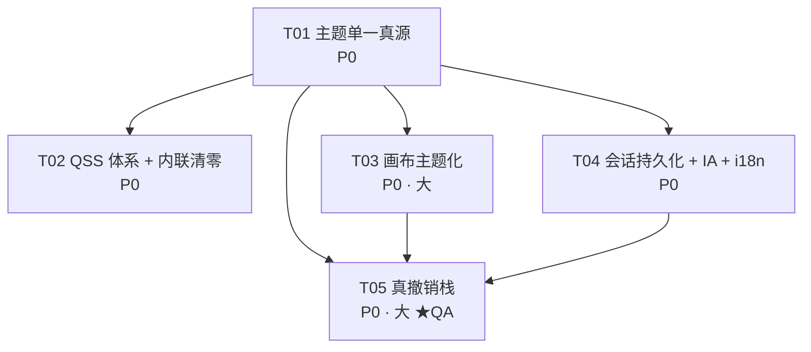

# MathLab UI 改造 — 系统设计与任务分解

| 项 | 内容 |
|---|---|
| 文档版本 | v1.0 |
| 作者 | 高见远（架构师） |
| 输入 | `mathlab/docs/UIUX_PRD.md` v1.0（25 问题 / 28 需求 / §6 Design Token）|
| 约束 | 遵守仓库根 `AGENTS.md` §4 架构约定（ui→core→utils、Mixin 规则、引擎唯一实例化点）|
| 性质 | **设计文档，不含源码改动**。工程师可直接照 §8/§9 实施 |
| 范围 | 仅 `mathlab/ui/`、`mathlab/utils/theme_manager.py`、`mathlab/main.py` 样式链路，及 R-10 撤销栈所需的 `mathlab/core/` 最小增量 |

---

## 0. 已拍板决策（本设计的硬输入）

| # | 决策 | 设计落点 |
|---|---|---|
| D-1 | 强调色统一**蓝系 `#3B82F6`**（dark），绿色降级为 `success` 语义色 | §1.3 token 表、§2.4 QSS、§9 T01 |
| D-2 | 画板背景**跟随主题** + 偏好设置「白纸」开关（默认关） | §3.1、§4、§9 T03 |
| D-3 | 撤销栈采用**方案 A（真撤销栈）**，动 `core/`，偏好保留启用开关 | §6、§9 T05 |
| D-4 | 三主题 light / dark / sepia 全保留 | 全文 |
| D-5 | 不引入第三方 QSS 组件库（qt-material 等） | §2.1 |

> PM 勘误已采纳：P0 14（小6/中6/大2）、P1 10、P2 4；两个「大」项 = R-04 画布主题化、R-10 真撤销栈；
> 「关闭抗锯齿」证据行为 `canvas.py:289`。

---

## 1. 目标架构：主题单一真源（对应 R-01 / R-02 / R-07 / UI-01 / UI-02）

### 1.1 根因回顾（为什么现在改不动）

| # | 注入点 | 层级 | 效果 |
|---|---|---|---|
| ① | `main.py:202-204` `app.setStyleSheet(styles.qss)` | App | 被②整体替换 |
| ② | `theme_manager.py:126` `app.setStyleSheet(内联QSS)` | App | 覆盖① |
| ③ | `_mixin_ui_setup.py:199` `self.setStyleSheet(qss)` | **窗口** | **优先级最高，向下继承整棵子树** |

结论：MainWindow 子树被硬编码深色 `styles.qss` 锁死；`set_theme()` 只影响主窗口之外的独立窗口。
`load_stylesheet()` 的 11 处 `qss.replace()` 中 10 处是死代码，唯一命中的 `#FFFFFF`（`styles.qss:62`，按钮按下文字色）被错配为 `console_fg` → **该 replace 方案必须整体废弃，不可修补**。

### 1.2 目标架构

```
                    ┌─────────────────────────────────────────────┐
                    │  mathlab/utils/theme_tokens.py   (SSOT 数据) │
                    │  THEME_TOKENS: dict[str, dict[str,str]]      │
                    └───────────────┬─────────────────────────────┘
                                    │ 唯一数据源
              ┌─────────────────────┼──────────────────────┐
              ▼                     ▼                      ▼
   mathlab/ui/styles.qss   theme_manager.set_theme()   Python 绘制代码
   （${token} 占位符模板）   渲染 → app.setStyleSheet    canvas_theme.py /
              │             → app.setPalette              preferences / panels
              └──► 渲染产物（唯一一次 app 级注入）
                                    │
                                    ▼
                    theme_signals.theme_changed(str)   ← core/signals.py 新增
                                    │
              ┌─────────────────────┼──────────────────┐
              ▼                     ▼                  ▼
       GeometryCanvas        PropertiesPanel      其他订阅者
       （清缓存/重刷笔刷）     （重取语义色）
```

**唯一写入点**：`theme_manager.set_theme(name)`（内部调用 `apply_theme_tokens()`）。
**唯一外部入口**：`DialogsMixin.apply_theme(theme_key)`（`_mixin_dialogs.py`，已存在）。

### 1.3 Token 定义：`mathlab/utils/theme_tokens.py`

> ⚠️ **对 PRD §6.8 的一处偏离（架构判断）**：PRD 建议放 `mathlab/ui/theme_tokens.py`。
> 但 `theme_manager` 位于 `utils` 层且必须由它渲染 QSS——`utils → ui` 导入违反 AGENTS.md §4.1 硬规则。
> 因此**规范位置 = `mathlab/utils/theme_tokens.py`**（纯数据、零 Qt 依赖、可单测），
> 同时按 PRD 命名提供**再导出垫片** `mathlab/ui/theme_tokens.py`（合法方向 ui→utils），
> 既满足 PRD 文件名，又不破坏分层。若用户坚持单一位置，删掉垫片即可（一行切换，见 §11 O-1）。

```python
# mathlab/utils/theme_tokens.py（纯数据，禁止 import Qt）
THEME_TOKENS: dict[str, dict[str, str]] = {
    "dark": {
        # 背景（分层，ΔL ≥ 4）
        "bg.base":     "#0F172A", "bg.surface": "#1E293B", "bg.elevated": "#263449",
        "bg.canvas":   "#0B1220", "bg.inset":   "#0B1220",
        "bg.hover":    "rgba(255,255,255,0.06)",
        "bg.selected": "rgba(59,130,246,0.16)",
        # 边框
        "border.subtle": "#334155", "border.strong": "#475569",
        # 文字
        "fg.primary": "#F8FAFC", "fg.secondary": "#94A3B8", "fg.muted": "#64748B",
        "fg.onAccent": "#FFFFFF",
        # 强调色（唯一，蓝系 — D-1）
        "accent.base": "#3B82F6", "accent.hover": "#60A5FA", "accent.pressed": "#2563EB",
        # 语义色（绿降级为 success — D-1）
        "success": "#22C55E", "warning": "#EAB308", "danger": "#EF4444",
        # 画布
        "canvas.grid": "#334155", "canvas.axis": "#64748B",
        # 几何对象
        "obj.point": "#60A5FA", "obj.segment": "#A78BFA", "obj.circle": "#2DD4BF",
        "obj.polygon": "#C084FC", "obj.conic": "#F472B6", "obj.function": "#38BDF8",
        "obj.implicit": "#818CF8", "obj.locus": "#FB923C", "obj.selection": "#3B82F6",
    },
    "light": { ... },   # 按 PRD §6.2 逐项填入（accent=#004AC6）
    "sepia": { ... },   # 按 PRD §6.2 逐项填入（accent=#8B5A2B）
}

# 非 token 的常量（形状/间距/字号/动效），QSS 与 Python 共用
SHAPE_TOKENS  = {"radius.xs": 4, "radius.sm": 6, "radius.md": 8, "radius.lg": 12,
                 "radius.xl": 12, "radius.full": 9999}
SPACE_TOKENS  = {"space.1": 4, "space.2": 8, "space.3": 12, "space.4": 16,
                 "space.6": 24, "space.8": 32}
CONTROL_MIN_H = {"input": 32, "input_default": 36, "button": 32, "primary": 40, "toolbar": 28}
FONT_TOKENS   = {"size.xs": 11, "size.sm": 12, "size.base": 13, "size.md": 14,
                 "size.lg": 16, "size.xl": 20}
FONT_FAMILY   = {"ui": "…", "mono": "…", "ui.mac_fallback": "PingFang SC"}
MOTION_TOKENS = {"fast": 120, "base": 200, "slow": 300, "emphasis": 600}
```

**旧 `THEMES` → token 映射表**（`theme_manager.THEMES` 保留为兼容视图，由 token 派生，见 §1.7）：

| 旧 key | 新 token | 备注 |
|---|---|---|
| `background` / `foreground` | `bg.base` / `fg.primary` | |
| `panel_bg` / `panel_border` | `bg.surface` / `border.subtle` | |
| `accent` | `accent.base` | light 主题值 `#004AC6` 不变 |
| `secondary` | `obj.segment` | **废弃**：PRD 禁止第二强调色 |
| `console_bg` / `console_fg` | `bg.inset` / `fg.primary` | |
| `success` / `warning` / `error` | `success` / `warning` / `danger` | |
| `point_color` / `segment_color` / `circle_color` / `polygon_color` | `obj.point` / `obj.segment` / `obj.circle` / `obj.polygon` | |
| `name` | （保留，主题显示名） | |

### 1.4 `theme_manager.py` 改造（公共 API 保持不变）

保留现有对外签名（`THEMES` / `get_current_theme` / `set_theme` / `get_theme_colors` / `load_settings` / `save_settings`），
内部替换为：

```python
def set_theme(theme_name: str) -> bool:
    if theme_name not in THEME_TOKENS:
        return False
    tokens = THEME_TOKENS[theme_name]
    _cached_theme = theme_name
    _apply_user_accent_override(tokens)          # §11 O-2，用户自选强调色
    _apply_palette(tokens)                       # QPalette（保留现逻辑，色值改取 token）
    qss = render_qss(theme_name)                 # 模板渲染，唯一一次
    assert "${" not in qss, "模板占位符未替换干净"
    QApplication.instance().setStyleSheet(qss)   # ← 全应用唯一一次 app 级注入
    save_settings({"theme": theme_name})
    from mathlab.core.signals import theme_signals   # 函数内延迟导入（见下）
    theme_signals.theme_changed.emit(theme_name)     # ← 驱动画布等订阅者
    return True
```

> **循环导入豁免说明**（与 AGENTS.md §4.1 一致）：`utils.theme_manager → core.signals` 采用**函数内延迟导入**，
> 与 `config_manager` / `i18n_manager` 的既有模式相同，需在两处代码注释中标注「documented cycle-escape」。

### 1.5 三处入口的收敛决策

| 位置 | 处置 | 理由 |
|---|---|---|
| `main.py:201-209`（读 styles.qss → `app.setStyleSheet`） | **整段删除**（约 9 行） | 留着就是第二个写入点；MainWindow 内部会立即触发 `apply_theme()` |
| `_mixin_ui_setup.py::load_stylesheet()`（176-201） | **整方法删除**，调用点 `main_window.py:103` 一并删除 | 11 处 replace 已判死刑；窗口级注入正是 UI-01 根因 |
| `_mixin_dialogs.py::apply_theme(theme_key)` | **保留并成为唯一外部入口**：`set_theme()` + `update_toolbar_icons()`，后续追加 `_refresh_theme_dependent_widgets()` | 语义清晰、调用方（preferences / menus）已在使用 |
| `theme_manager.set_theme()` 内联 QSS（126-192） | **删除内联 QSS 字面量**，改为调用渲染器 | 消除第二套样式文本 |

**验收（A-02）**：`grep -rn "app.setStyleSheet\|self.setStyleSheet(" mathlab/` 仅命中 `theme_manager.render_qss()` 之后的那一行。

### 1.6 改造后调用链时序图

```mermaid
sequenceDiagram
    autonumber
    participant Main as main.py
    participant App as QApplication
    participant MW as MainWindow
    participant Setup as UISetupMixin
    participant Sess as session_state
    participant Dlg as DialogsMixin
    participant TM as theme_manager
    participant Tok as theme_tokens
    participant QSS as styles.qss(模板)
    participant Sig as theme_signals
    participant CV as GeometryCanvas
    participant QS as QSettings

    Main->>App: QApplication(argv) + 高DPI + 字体注入
    Main->>MW: MainWindow()
    MW->>MW: _init_engines()（引擎唯一实例化点）
    MW->>Setup: setup_ui() / setup_menus() / setup_toolbar() / setup_docks()
    Note over Setup: 全程禁止 setStyleSheet<br/>所有 Dock/面板 setObjectName()
    MW->>Sess: restore_session(self)
    Sess->>QS: value("window/geometry") / value("window/state")
    QS-->>Sess: QByteArray / 缺省
    Sess-->>MW: restoreGeometry/restoreState 或 _apply_default_layout()
    MW->>Dlg: apply_theme(get_current_theme())
    Dlg->>TM: set_theme("dark")
    TM->>Tok: THEME_TOKENS["dark"]
    Tok-->>TM: tokens dict
    TM->>QSS: render_qss(tokens)  [string.Template]
    QSS-->>TM: 完整 QSS 文本（无 ${ 残留）
    TM->>App: app.setPalette(p); app.setStyleSheet(qss)  ← 唯一一次
    TM->>QS: save_settings({"theme": "dark"})
    TM->>Sig: theme_changed.emit("dark")
    Sig-->>CV: _on_theme_changed("dark")
    CV->>CV: 清画笔缓存 → 重建 QPen/QBrush → 重刷 object_map → scene.invalidate()
    Note over MW: QTimer.singleShot(0, _deferred_init) — 与现状一致

    rect rgb(240,240,255)
    Note over Dlg,TM: 用户在偏好里切主题（运行时，同一条链路）
    Dlg->>TM: set_theme("light")
    TM->>Sig: theme_changed.emit("light")
    Sig-->>CV: _on_theme_changed("light")（无需重启）
    end
```

### 1.7 兼容性垫片（降低改造风险的关键）

`theme_manager.THEMES` **保留**，由 token 派生：

```python
_TOKEN_TO_LEGACY = {
    "background": "bg.base", "foreground": "fg.primary", "panel_bg": "bg.surface",
    "panel_border": "border.subtle", "accent": "accent.base", "secondary": "obj.segment",
    "console_bg": "bg.inset", "console_fg": "fg.primary",
    "success": "success", "warning": "warning", "error": "danger",
    "point_color": "obj.point", "segment_color": "obj.segment",
    "circle_color": "obj.circle", "polygon_color": "obj.polygon",
}

def get_theme_colors(theme_name=None) -> dict:
    tokens = get_tokens(theme_name)
    return {legacy: tokens[tok] for legacy, tok in _TOKEN_TO_LEGACY.items()}
            | {"name": theme_name.title()}
```

存量消费者（`_mixin_dialogs.py`、`preferences_dialog.py`、`_mixin_ui_setup.py`）**不需要一次性改完**即可编译运行；
新代码一律走 `get_tokens()`（见 §10 共享知识）。垫片标注 `# DEPRECATED: new code must use get_tokens()`。

---

## 2. QSS 体系决策（对应 R-05 / R-06 / UI-05 / UI-06）

### 2.1 决策

> **单文件模板 + 运行时渲染**：保留路径 `mathlab/ui/styles.qss` 不变，文件内容改为
> Python `string.Template` 语法的 `${token}` 占位符，由 `theme_manager.render_qss()` 渲染。

### 2.2 备选对比

| 方案 | 优点 | 缺点 | 结论 |
|---|---|---|---|
| **A. 单文件 `${token}` 模板（现路径）** | 零打包风险（两份 spec 已映射 `mathlab/ui/*.qss`）；三主题共用一份 → 不会漂移；无新依赖 | 文件偏长（预计 ~520 行） | ✅ **采纳** |
| B. 三份静态 QSS（dark/light/sepia） | 无运行时开销 | 三份必然漂移（正是 UI-07 根因）；每加一个控件改三处 | ✗ |
| C. `mathlab/ui/styles/` 分片模板目录 | 组织最清晰 | **必须同步改两份 PyInstaller spec 的 datas**（`mathlab/ui/*.qss` glob 不匹配子目录）→ 打包回归风险 | ✗ 本期不做，§2.3 留扩展位 |
| D. 引入 qt-material 等第三方库 | 现成控件样式 | 第二套 token 真源，违反 D-5 / PRD Q3 | ✗ |

### 2.3 目录布局与打包影响

```
mathlab/ui/styles.qss               # 模板（路径不变 → 两份 spec 零改动）★
mathlab/utils/theme_tokens.py       # token SSOT（纯数据）
mathlab/ui/theme_tokens.py          # 再导出垫片 `from mathlab.utils.theme_tokens import *`
mathlab/utils/theme_manager.py      # 渲染器 render_qss() + set_theme() 唯一出口
```

> 未来若模板超过 ~700 行，再拆 `mathlab/ui/styles/*.qss.tpl` 并**同步修改**
> `mathlab.spec` 与 `mathlab/build_spec.spec` 的 `added_files` / `app_datas` —— 记入 §11 风险 R-4。

### 2.4 模板分区结构与必覆盖控件清单

文件内以 banner 注释分区（本期不拆文件）：

```
/* ═══════ §0 Base — 变量语义说明、QDialog/QMainWindow 容器 ═══════ */
/* ═══════ §1 Widget — 基础控件（14 类新增） ═══════ */
/* ═══════ §2 Component — Dock/Tab/Toolbar/命令面板/Toast ═══════ */
/* ═══════ §3 Utility — 滚动条、Tooltip、focus 环、禁用态 ═══════ */
/* ═══════ §4 Page — PreferencesDialog 专属（QDialog#preferencesDialog 前缀） ═══════ */
```

**§1 必补控件**（现状 13 类 → 目标 27 类，对应 R-05）：

| 新增 | 关键子选择器 |
|---|---|
| `QGroupBox` | `::title`, `:indicator` |
| `QSlider` | `::groove`, `::handle`, `::sub-page` |
| `QScrollArea` | `> QWidget > QWidget { background: transparent }`（防白底） |
| `QTextEdit` | 同 `QPlainTextEdit` |
| `QDoubleSpinBox` | `::up-button`, `::down-button` |
| `QCheckBox` / `QRadioButton` | `:indicator`, `:checked`, `:hover` |
| `QListWidget` / `QTreeWidget` | `::item`, `::item:selected`, `::item:hover` |
| `QSplitter` | `::handle`, `::handle:hover` |
| `QToolTip` | 独立配色（`bg.elevated` + `fg.primary`） |
| `QProgressBar` | `::chunk` |
| `QStatusBar` / `QToolBar` | `::separator` |
| `QMenu` / `QMenuBar` | `::item`, `::item:selected`, `::separator`（现状仅 theme_manager 内联有） |
| `QCommandLinkButton`、`QLineEdit[readOnly="true"]` | 按需 |

**§0 禁止事项（R-06 / AGENTS.md §5.2）**：

- ❌ 裸 `QWidget { background-color: … }`（现 `styles.qss:6-9`，**必须删除**）
- ❌ `QDockWidget > QWidget`（命中 dock 内任意子控件）
- ✅ 允许：具体类型选择器、`#objectName` 选择器、动态属性选择器 `[state="…"]`
- 兜底策略：删除全局规则后，`central_tabs`、各 Dock 根、`GeometryCanvas` 视口必须显式给背景，
  否则会出现"原生灰白底"回归 → 与 §9 T02 同一任务内完成，禁止分开提交。

---

## 3. Canvas 主题化方案（对应 R-04 / R-17 / UI-04 / UI-15 / UI-24）

### 3.1 新增 `mathlab/ui/canvas_theme.py`（纯数据，零 Qt 依赖，可单测）

```python
@dataclass(frozen=True)
class CanvasPalette:
    theme: str
    paper: str        # bg.canvas 或 白纸模式下的 #FFFFFF
    grid: str         # canvas.grid
    axis: str         # canvas.axis
    point: str; segment: str; circle: str; polygon: str
    conic: str; function: str; implicit: str; locus: str
    selection: str    # 替代写死的 QColor(0,120,215)
    draft: str        # 草稿态（现为 QColor(0,120,215,100)）→ accent.base + alpha
    label: str        # MathGraphicsItem 降级文本色（现 #0b1c30 @ canvas.py:123）→ fg.primary

def resolve_canvas_palette(theme_name: str, white_paper: bool = False) -> CanvasPalette:
    """white_paper=True（偏好「白纸」开关，D-2）时 paper 固定 #FFFFFF，
    grid/axis 取 light 主题的浅灰，对象色保持当前主题（保证曲线在白纸上可读）。"""
```

### 3.2 画笔缓存失效：**theme-keyed `lru_cache`**（不是 `cache_clear()`）

```python
@lru_cache(maxsize=8)                       # 3 主题 × 白纸开关 = 最多 6 个 key
def _get_grid_pen(theme_name: str, white_paper: bool) -> QPen:
    pal = resolve_canvas_palette(theme_name, white_paper)
    pen = QPen(QColor(pal.grid), 0.5); pen.setStyle(Qt.DashLine); return pen

@lru_cache(maxsize=8)
def _get_origin_pen(theme_name: str, white_paper: bool) -> QPen: ...
```

调用点 `drawBackground()`（`canvas.py:363-397`）改为传入
`_get_grid_pen(self._theme_name, self._white_paper)`。
**按 key 失效**优于 `cache_clear()`：零竞态、旧主题画笔可复用、改动仅 2 行签名 + 2 行调用。
`drawBackground` 首行 `self.scene_obj.setBackgroundBrush(QColor(pal.paper))`（原 `canvas.py:292` 的 `#ffffff` 删除）。

### 3.3 主题变更订阅与重绘

```python
# canvas.py — GeometryCanvas.__init__ 末尾
from mathlab.core.signals import theme_signals
theme_signals.theme_changed.connect(self._on_theme_changed)

def _on_theme_changed(self, theme_name: str) -> None:
    self._theme_name = theme_name
    self._white_paper = bool(get_config("canvas_white_paper", False))
    self.scene_obj.setBackgroundBrush(QColor(self._palette.paper))
    self._refresh_all_object_brushes()      # §3.4
    self.scene_obj.invalidate(QGraphicsScene.AllLayers)   # 强制 drawBackground 重跑
    self.viewport().update()
```

> 信号发射发生在 `app.setStyleSheet` **之后**（§1.6 步骤 10-11），因此重绘看到的是新 token。
> **主线程安全**：`set_theme()` 只会在主线程被调用（偏好对话框 / 启动路径），`Signal` 为直接连接，无需队列。

### 3.4 `object_map` 笔刷重刷策略（UI-15 第二半）

现状痛点：对象颜色在**创建时**写死（`canvas.py:728-799`、`:830-839`、`:870-928`），主题切换后不刷新；
且 `properties_panel.color_changed`（`_mixin_signals.py` → `on_object_color_changed`）允许用户改色。

策略（一次改动解决三件事）：

1. **object_map 记录类型与用户色**：`draw_object()` / `update_object()` 写入
   `self.object_map[obj_id] = {"point": item, "text": t, "type": obj_type, "user_color": hex_or_None}`。
   `user_color` 在 `set_user_color()`（`canvas.py:965` 附近）时写入 → 用户意图优先级最高。
2. **统一取色入口**：新增
   `self._pen(kind: str, width: float, dash=False, alpha=None)` 与
   `self._brush(kind: str, alpha=None)`，内部查 `self._palette` + `user_color` 覆盖。
   替换上述三段散落的 `QColor(...)` 字面量（共 ~29 处）。
3. **重刷**：

```python
def _refresh_all_object_brushes(self) -> None:
    for obj_id, info in self.object_map.items():
        kind = TYPE_TO_KIND.get(info.get("type", ""), None)   # Point→point, ConicSection→conic…
        if kind is None:
            continue
        pen = self._pen(kind, info.get("stroke", 2.0))
        brush = self._brush(kind)
        for key in ("point", "segment", "circle", "polygon", "curve"):
            if key in info:
                info[key].setPen(pen); info[key].setBrush(brush)
        # user_color 非空时 _pen/_brush 已自动让位给 user_color
    # 草稿态项（is_draft）单独用 draft 色 + DashLine + 0.6 透明度
```

### 3.5 与 PRD 的对应

| PRD | 本设计落点 |
|---|---|
| R-04 / UI-04 | §3.1-3.4 全部；`grep -n theme canvas.py` 命中数 ≥ 3 |
| R-17 / UI-15 | §3.2（缓存失效）+ §3.3（信号订阅重绘） |
| R-25 / UI-24 | `setOptimizationFlag(DontAdjustForAntialiasing, True)`（`canvas.py:289`）→
  `self.setOptimizationFlag(…, not get_config("aa_enabled", True))`，偏好「图形质量」页已有 `aa_enabled` |
| D-2 白纸开关 | §3.1 `resolve_canvas_palette(white_paper=…)`；开关状态存 QSettings `canvas/whitePaper`（§5） |

---

## 4. Preferences 对话框主题化（对应 R-03 / UI-03，975 行 / 55 处内联 / 88 处 HEX）

### 4.1 现状

- 模块级 `_TAB_STYLE`（`:54-90`）硬编码浅色（`#ffffff` / `#f8f9ff` / `#c3c6d7` / `#434655` / `#004ac6`）。
- 55 处 `setStyleSheet`，17 处 `background: white`；全文无 `get_theme_colors()`（仅 `:120` 取默认主题）。
- 已有 5 页结构（外观/图形/控制台/快捷键/高级/AI Lab）与 `retranslate_ui()`，**结构可复用，只换皮肤**。

### 4.2 方案：**class 选择器 + objectName 命名空间**，内联清零到 ≤ 3 处

1. **建命名空间**：`_build_ui()` 首行 `self.setObjectName("preferencesDialog")`；
   5 个 `_page_*()` 返回的 `QScrollArea` 与内部 section 卡片统一 `setObjectName("prefSection")` / `setObjectName("prefCard")`。
2. **删除 `_TAB_STYLE`** 与全部内联样式 → 移入模板 **§4 Page** 分区，全部以
   `QDialog#preferencesDialog …` 前缀（防止泄漏到主窗口）。
3. **动态色保留 ≤ 3 处**：`_ACCENT_COLORS` 的 5 个色板按钮（用户可自选强调色，运行时才知道颜色）
   → 保留 `setStyleSheet`，但色值来自 token 与用户选择，注释标 `// ALLOWED-INLINE: dynamic accent swatch`。
4. **强调色覆盖层**（§11 O-2）：用户选中的强调色写入 `settings.json["accent"]`，
   `set_theme()` 内 `_apply_user_accent_override()` 把 `accent.base/hover/pressed` 三个 token 覆写后渲染
   → 保持「单一 accent token」不变量，只是值可被用户覆写。
5. **迁移映射**（机械替换，工程师照表执行）：

| 现状内联 | 目标 |
|---|---|
| `background: white`（17 处） | `QDialog#preferencesDialog QWidget#prefCard { background: ${bg.surface} }` |
| `color: #0b1c30` | `${fg.primary}` |
| `border: 1px solid #c3c6d7` | `1px solid ${border.subtle}` |
| `color: #004ac6` / `border-left: 3px solid #004ac6` | `${accent.base}` |
| `:hover background #eff4ff / #e5eeff` | `${bg.hover}` |
| `min-height: 32px` | `${$CONTROL_MIN_H.input}px` → 模板中写死 32 并注释来源 |
| 字号/字重 | `${font.size.*}` 对应值 |

### 4.3 验收

- 深色 / 棕褐主题下打开偏好：**无任何白色区块**（3 主题 × 截图 diff）。
- `grep -c setStyleSheet mathlab/ui/preferences_dialog.py` ≤ 3。
- `grep -cE "#[0-9A-Fa-f]{3,6}" mathlab/ui/preferences_dialog.py` ≤ 5（仅色板列表）。

---

## 5. 窗口状态持久化（对应 R-09 / UI-16 / A-05）

### 5.1 边界（避免第二套真源）

| 数据 | 存储 | 理由 |
|---|---|---|
| 主题 / 语言 / 各类偏好 | `mathlab/settings.json`（现状） | 已是用户偏好真源，不动 |
| **窗口几何 / Dock 布局 / Tab 索引 / 画布开关** | **`QSettings`**（新增） | 二进制 QByteArray 不适合 JSON；会话态 ≠ 偏好 |

### 5.2 新增 `mathlab/ui/session_state.py`（纯函数模块，不动 Mixin 数量）

```python
ORG = "MathLab"; APP = "MathLab"

def make_settings() -> QSettings:
    return QSettings(QSettings.IniFormat, QSettings.UserScope, ORG, APP)
    # IniFormat：跨平台一致、可肉眼检查、无注册表权限问题；文件落在用户配置目录（勿入库）

SCHEMA_VERSION = 1

def save_session(win: QMainWindow) -> None: ...
def restore_session(win: QMainWindow) -> None: ...
def reset_session(win: QMainWindow) -> None: ...      # 「恢复默认布局」入口
def _apply_default_layout(win: QMainWindow) -> None:  # 首启默认
```

### 5.3 Key 命名规范（共享知识，见 §10）

| Key | 类型 | 说明 |
|---|---|---|
| `window/schemaVersion` | int | 布局 schema 版本，不匹配时丢弃并走默认布局 |
| `window/geometry` | QByteArray | `saveGeometry()` |
| `window/state` | QByteArray | `saveState()`（依赖所有 dock/toolbar 的 `objectName`） |
| `docks/<objectName>/visible` | bool | Dock 显隐兜底（saveState 已含，用于 `_apply_default_layout` 判断） |
| `central/lastTabIndex` | int | 中央 QTabWidget 末选页 |
| `canvas/whitePaper` | bool | D-2 白纸开关 |
| `session/firstRun` | bool | 首启标记 |

### 5.4 调用时机

```
MainWindow.__init__:
  setup_ui() → setup_menus() → setup_toolbar() → setup_docks()
  【原 :103 load_stylesheet 删除】
  restore_session(self)        ← 恢复几何/布局/末选 Tab；失败或 schema 不符 → _apply_default_layout()
  connect_signals() → _register_commands()
  apply_theme(get_current_theme())
  QTimer.singleShot(0, _deferred_init)   # 插件动态 Dock 在此之后创建，属正常

MainWindow.closeEvent:
  save_session(self)           ← 放在最前（快、无副作用），再做 autosaver/插件卸载/线程池等待
```

### 5.5 首启默认布局（`_apply_default_layout`）

- 几何：`QGuiApplication.primaryScreen().availableGeometry()` 的 80%，居中（**删除** `main_window.py:71` 的 `setGeometry(100,100,1200,800)`）。
- 中央 Tab 首页 = **几何画板**（R-08：`_mixin_ui_setup.py:59-62` 调整 addTab 顺序为 画板 → Notebook → Mini GeoGebra → Jupyter）。
- 可见面板：代数 / 属性 / 控制台；`function_explorer` 隐藏；`algo_vis_panel` 与 `ai_tools_panel` 在右侧 Tab 组**可见**（R-15，改 `_mixin_ui_setup.py:146,151,156` 的 `hide()`）。
- 前置条件：`setup_docks()` 中为每个 `QDockWidget` 补 `setObjectName("dockAlgebra")` 等（`restoreState` 依赖）。

### 5.6 验收（A-05）

拖动 dock → 改尺寸 → 切 Tab → 退出重启：几何、Dock 位置、显隐、分割比例、末选 Tab 全部还原；
「视图 → 恢复默认布局」一键回到 §5.5；删除 `QSettings` ini 文件后首启行为正确。

---

## 6. 撤销栈设计 — 方案 A：真撤销栈（R-10 / UI-13，已拍板 D-3）

### 6.1 可行性依据（已核实源码）

| 基础设施 | 位置 | 可复用点 |
|---|---|---|
| `GeometricObject.serialize()` / **`deserialize()`** | `core/models/base.py` | 18 种类型全覆盖 → **快照重建无需新序列化协议** |
| `DAG` | `core/models/dag.py` | `add_edge` / `remove_node` / `get_dependents` → 可完整重建依赖图 |
| 事件通道 | `core/geometry_engine.py` `_notify()` + Qt 信号 `object_added/updated/removed/geometry_event` | **所有**变更（含 REPL `draw_point`、脚本、命令）都会发事件 → 撤销可在单一订阅点捕获，**不需要改每个调用方** |
| 事务钩子 | `begin_draft()` / `commit_draft()` / `discard_draft()` / `block_signals()` | 复用为「手势事务」边界 |
| 命令注册 | `core/command_manager.py`（`Command`/`CommandManager`，`main_window.py:80` 已实例化） | 撤销/重做作为命令暴露给命令面板 |

### 6.2 新增 `mathlab/core/undo_stack.py`（~220 行，纯逻辑层，无 GUI 依赖）

```python
@dataclass(frozen=True)
class GeometrySnapshot:
    """整场景不可变快照。粒度 = 全场景（非单对象），理由见 §6.3。"""
    objects: tuple[tuple[str, dict], ...]   # (obj_id, serialize())，插入序
    edges: tuple[tuple[str, str], ...]      # DAG (parent_id, child_id)
    name_counters: tuple[tuple[str, int], ...]
    free_names: tuple[tuple[str, tuple[str, ...]], ...]

class UndoCommand:
    """一条可撤销的几何操作 = (before, after, label, timestamp)。"""
    def __init__(self, before: GeometrySnapshot, after: GeometrySnapshot, label: str): ...
    @property
    def text(self) -> str: ...           # 用于 Toast/菜单文案（i18n key：undo.op.<label>）

class UndoStack(QObject):
    undo_available = Signal(bool)
    redo_available = Signal(bool)
    stack_changed = Signal(int)          # 栈深（调试/菜单后缀）

    MAX_DEPTH = 50                        # 栈深上限（可被偏好覆盖 10–200）

    def __init__(self, engine: GeometryEngine, max_depth: int = MAX_DEPTH): ...
    def begin_gesture(self, label: str) -> None: ...   # 记录 before 快照
    def end_gesture(self) -> bool: ...                 # 记录 after；无差异则丢弃，返回 False
    def cancel_gesture(self) -> None: ...              # 异常时回滚
    def undo(self) -> bool: ...
    def redo(self) -> bool: ...
    def clear(self) -> None: ...
```

**快照粒度决策：整场景而非单对象。**
单对象逆操作（`add_point` ↔ `remove_point`）在存在 DAG 依赖传播时（`remove_object` 会级联删除 dependents、
`update_point` 会重算 dependents 坐标）必须同时回滚受影响子树，等价于部分快照，却要为 18 种类型写逆操作 → 错误率高。
整场景快照 = `objects` 字典 + `edges` 元组，教室规模（几百对象）内存与耗时都在毫秒级；
栈深 50 上限 + 单快照字节阈值（`len(json) > 2MB` 时跳过记录并 `logger.warning`）兜底。

### 6.3 `GeometryEngine` 最小增量（`core/geometry_engine.py`，+~90 行，不动既有算法）

```python
def snapshot(self) -> GeometrySnapshot:
    """导出全场景快照（复用 GeometricObject.serialize()，零新协议）。"""

def restore_snapshot(self, snap: GeometrySnapshot) -> None:
    """按拓扑序重建：
    1) self._restoring = True（新增标志位，抑制撤销记录器自捕获）
    2) self.objects.clear(); self.dependencies = DAG()   # DAG 无 clear()，直接重建最安全
    3) Kahn 拓扑排序 edges → 依序 GeometricObject.deserialize(data) 入 objects
    4) 重建 name_counter / _name_set / _free_names
    5) self._restoring = False; self._notify("scene_restored", {"count": n})
    """
```

`_notify()` 增加一行守卫：`if getattr(self, "_restoring", False): return` 之前的**记录逻辑**仍要发事件给 UI
（画布需要重绘），所以采用「**恢复期间不记录，但事件照发**」：
`UndoStack` 在 `_restoring` 期间暂停 `begin_gesture` 自动捕获，仅监听 `scene_restored` 以触发 UI 刷新。

### 6.4 与既有 `CommandManager` 的融合（不并轨，只暴露）

- `UndoStack` **不**注册进 `CommandManager`（命令面板的 `Command.action` 是无参幂等操作，撤销栈是有状态栈，语义不同）。
- 在 `CommandsMixin._register_commands()` 中注册两条命令供 Ctrl+K / 命令面板搜索：
  `undo.last` → `self.undo_stack.undo`、`redo.last` → `self.undo_stack.redo`。
- `_mixin_menus.py:63-67` 的 `undo_action`/`redo_action` 保留**菜单项与快捷键**，
  `triggered` 从桩 lambda（`:175-188`，删除）改为连接 `undo_stack.undo/redo`；
  并用 `undo_available`/`redo_available` 信号驱动 `setEnabled()`（灰置而非隐藏，保留用户可发现性）。

### 6.5 事务边界与拖拽合并（避免「拖一下 = 50 条撤销」）

| 入口 | 事务策略 |
|---|---|
| 工具栏/画布新增（`on_point_added` 等 4 个信号） | `begin_gesture("add_point")` → 引擎调用 → `end_gesture()` |
| 删除（`on_object_deleted` / `on_delete_selected`） | 同上，label=`delete`（级联删除会一次 restore 整棵子树） |
| **拖拽移动**（`canvas.py:243` `itemChange` → `object_moved` 连续发射） | 拖拽期间**只** `begin_gesture`；`mouseReleaseEvent`（`canvas.py:558`）新增
  `object_move_finished = Signal(str)` 并在 `_mixin_signals.py` 中 `end_gesture()` → 一次拖拽 = 一条撤销 |
| 方程编辑（`on_equation_changed`） | 失焦/回车时作为一次手势 |
| REPL / 脚本 / AI 生成（走引擎直调） | **兜底合并器**：`UndoStack` 内置 500ms 防抖自动手势 —— 收到事件且无打开的手势时，
  启动定时器；超时未再收到事件则自动 `begin+end`。保证所有路径可撤销，无需改每个调用方 |
| `clear()` / 打开项目 / 自动存档恢复 | `clear()` 撤销栈（不可跨越「载入」语义） |

### 6.6 撤销后的三处联动刷新（QA 回归重点）

`restore_snapshot()` 结束后发出 `scene_restored`，由 `SignalsMixin` 统一分发：

```python
def on_scene_restored(self, data: dict) -> None:
    self.central_widget.resync_from_engine()      # 清 object_map → 遍历 engine.objects → draw_object()
    self.algebra_panel.refresh_from_engine()      # 复用现有刷新路径（algebra_panel 已有类似方法）
    self.properties_panel.clear_selection()       # 选中对象可能已不存在
```

> **新增画布方法 `resync_from_engine()`**（`canvas.py`，~20 行）：封装 `clear_canvas()` + 遍历重绘。
> 这是撤销后画布/代数列表/属性面板一致性的唯一保证点 —— **QA 必测**：
> 删除一个被线段/圆引用的点 → 撤销 → 三处视图必须同时恢复，且 DAG 依赖传播（拖动点带动子对象）不失效。

### 6.7 偏好开关（D-3）

`settings.json` / 偏好「高级」页新增 `enable_undo: true`。
关闭时：`undo_action`/`redo_action` 灰置 + 菜单项文案追加「（未启用）」，`UndoStack` 不订阅事件（零开销）。

### 6.8 验收标准

| # | 场景 | 期望 |
|---|---|---|
| U-1 | 画点 → Ctrl+Z → Ctrl+Y | 点消失又出现，代数列表/属性面板同步 |
| U-2 | 删除被引用的点（级联） → Ctrl+Z | 整棵子树恢复，拖动该点仍带动子对象（DAG 不破坏）★QA 重点 |
| U-3 | 拖动点 30 次 → 松手 → Ctrl+Z | **仅 1 条**撤销记录，坐标回到拖拽前 |
| U-4 | REPL 执行 `draw_circle(...)` → Ctrl+Z | 可撤销（兜底合并器生效） |
| U-5 | 连续 60 次操作 | 栈深 = 50，最早的不可再撤 |
| U-6 | 偏好关闭 `enable_undo` | Ctrl+Z 无效且菜单灰置 |
| U-7 | 撤销后立即关闭软件 | AutoSaver 不保存中间态异常；无崩溃 |

### 6.9 已否决的方案 B（留档）

移除假菜单项与快捷键（仅改 `_mixin_menus.py` 两处，改动面最小）。因用户已拍板方案 A 而否决；
若 T05 实施中快照方案遇阻（见 §11 R-2），**B 可作为降级逃生舱**，一天内可完成。

---

## 7. 内联样式治理策略（对应 R-03 / UI-07 / A-03）

### 7.1 基线（已实测核实）

| 指标 | 值 |
|---|---|
| `mathlab/ui/**.py` 内联 `setStyleSheet` | **173 处 / 20 个文件** |
| 硬编码 HEX（6 位） | **362 处**；3 位简写 13 处 + `rgba()` 4 处 + 具名色 57 处 → **合计约 411 处** |
| TOP 文件（内联） | `preferences_dialog` 55、`ai_tools_panel` 19、`properties_panel` 16、`command_bar` 11、`math_console` 10 |
| TOP 文件（HEX6） | `preferences_dialog` 88、`canvas` 29、`algo_vis_panel` 29、`notebook_panel` 24、`command_bar` 23 |

### 7.2 分批收敛（目标 A-03：内联 ≤ 20、HEX ≤ 40）

| 批次 | 优先级 | 文件（内联 / HEX6） | 收敛后余量 |
|---|---|---|---|
| **B1 本期 P0** | P0 | `preferences_dialog` 55/88、`properties_panel` 16/22、`_mixin_menus` 2/8、`_mixin_ui_setup` 2/11（即 replace 块）、`canvas` 0/29 | 内联 −75 → 98；HEX −158 → 253 |
| **B2 本期 P1** | P1 | `command_bar` 11/23、`math_console` 10/21、`algebra_panel` 6/15、`geometry_panel` 3/4、`jupyter_panel` 5/15、`code_editor` 4/5 | 内联 −39 → 59；HEX −83 → 170 |
| **B3 本期 P2** | P2 | `ai_tools_panel` 19/23、`function_explorer` 9/9、`notebook_panel` 9/24、`markdown_cell` 5/6、`geogebra_algebra` 7/7、`quiz_panel` 3/5、`floating_bubble` 1、`animated_widgets` 2、`interactive_widgets` 3、`console` 1/7、`algo_vis_panel` 0/29、其余散点 | 内联 −57 → **2**（≤20 ✓）；HEX −134 → **36**（≤40 ✓） |

**判定规则（写进脚本与 AGENTS.md）**：
- 允许保留的内联：① 动态运行时色（强调色板、用户选色、图表渐变）且行内含 `ALLOWED-INLINE` 注释；
  ② `objectName` 限定的单控件微调 ≤ 5 行。
- 一切静态色必须来自 token：Python 侧 `from mathlab.utils.theme_tokens import …`；
  QSS 侧 `${token}`。

### 7.3 防回潮：`mathlab/scripts/check_ui_style.py`（新增，~140 行）

```bash
python mathlab/scripts/check_ui_style.py            # 默认检查，超阈值 exit 1
python mathlab/scripts/check_ui_style.py --report   # 输出 Markdown 明细（供 PR 描述）
```

三条独立检查（阈值集中在文件头 `THRESHOLDS` 常量，便于随收敛进度调紧）：

| 检查 | 规则 | 当前阈值（收敛完成后的目标值） |
|---|---|---|
| S1 内联计数 | 正则 `\.setStyleSheet\(` 于 `mathlab/ui/**.py` | ≤ 20，且白名单文件（token 渲染器、动态色板）不计入 |
| S2 HEX 计数 | 正则 `#[0-9A-Fa-f]{3,6}\b` + `rgba?\(` + 具名色 于 `mathlab/ui/**.py` | ≤ 40 |
| S3 未连接 QAction | AST 扫描 `QAction` 赋值 → 同类作用域内必须有 `.triggered.connect` 或 `setEnabled(False)` | 0（A-07） |

**CI 接入**：`.github/workflows/code-quality.yml` 新增 job `ui-style-guard`（复制现有 flake8 job 骨架，
`pip install` 无新依赖，`python mathlab/scripts/check_ui_style.py`）。
配套在 `AGENTS.md` §5.2 追加一条「新增内联样式须走 token，CI 会拦」。

> 阈值策略：**先按当前基线（173/411）设为软阈值并输出 warning，B1 完成后改为硬阈值 98/253，
> B3 完成后改为 20/40**——避免第一天就把 CI 打红阻塞其他工作。

---

## 8. 文件清单

### 8.1 新增（8 个）

| # | 相对路径 | 内容摘要 | 预估行数 |
|---|---|---|---|
| N1 | `mathlab/utils/theme_tokens.py` | **SSOT**：`THEME_TOKENS`（3 主题 × 24 键）+ SHAPE/SPACE/FONT/MOTION 常量；纯数据零 Qt | 180 |
| N2 | `mathlab/ui/theme_tokens.py` | PRD 命名垫片：`from mathlab.utils.theme_tokens import *` + `__all__`（§1.3 偏离说明） | 15 |
| N3 | `mathlab/ui/canvas_theme.py` | `CanvasPalette` frozen dataclass + `resolve_canvas_palette(theme, white_paper)` | 95 |
| N4 | `mathlab/ui/session_state.py` | QSettings 封装：`save/restore/reset_session`、`_apply_default_layout`、Key 常量 | 150 |
| N5 | `mathlab/core/undo_stack.py` | `GeometrySnapshot` / `UndoCommand` / `UndoStack`（手势 API + 500ms 兜底合并器 + 栈深上限） | 220 |
| N6 | `mathlab/scripts/check_ui_style.py` | S1 内联 / S2 HEX / S3 未连接 QAction 三检查 + `--report` | 140 |
| N7 | `mathlab/scripts/check_i18n.py` | AST 扫描 `t("literal")` → 与 `locale/*.json` 求差集（R-12） | 90 |
| N8 | `mathlab/tests/unit/test_theme_tokens.py` + `test_undo_stack.py` | token 完整性（三主题键集一致、无 `${` 残留）与撤销栈逻辑单测 | 160 |

### 8.2 修改（15 个）

| # | 相对路径 | 改动摘要 | 预估 Δ行 |
|---|---|---|---|
| M1 | `mathlab/utils/theme_manager.py` | 删内联 QSS（126-192）；加 `render_qss()`/`get_tokens()`/`_apply_user_accent_override()`；`THEMES` 改派生视图；`set_theme()` 发信号 | +120 / −90 |
| M2 | `mathlab/ui/styles.qss` | 改 `${token}` 模板；删裸 `QWidget` 规则（6-9）；补 §1-§4 分区与 14 类控件 | +430 / −60 |
| M3 | `mathlab/main.py` | 删 201-209 的 styles.qss 加载（9 行） | −9 |
| M4 | `mathlab/ui/_mixin_ui_setup.py` | 删 `load_stylesheet()`（176-201）与调用点；删 `.upper()`（7 处）；Dock `setObjectName`；Tab 序调整（59-62）；面板默认可见性（146/151/156）；删 `add_dynamic_panel` 的 `.upper()`（282） | +40 / −50 |
| M5 | `mathlab/ui/_mixin_dialogs.py` | `apply_theme()` 成为唯一入口；删 `.upper()`（207-214）；`retranslate_ui()` 遍历全 Tab（146-148）；加「恢复默认布局」入口 | +55 / −25 |
| M6 | `mathlab/ui/_mixin_menus.py` | 撤销/重做接 UndoStack（63-67、175-188）；删 `tutorial_action`（151/153）；`show_theme_dialog`/`_toggle_theme` 统一到偏好（205）；6 个 tool action 补 tooltip+accessibleName（248-255）；lang_btn/settings_btn 内联清除（284-315）；3 处硬编码中文接 i18n（100/139/140） | +70 / −60 |
| M7 | `mathlab/ui/_mixin_signals.py` | 撤销手势包裹（§6.5）；`object_move_finished` 接线；`on_scene_restored` 分发 | +45 / −10 |
| M8 | `mathlab/ui/main_window.py` | 删硬编码 `setGeometry`（71）与 `load_stylesheet` 调用（103）；`__init__` 加 `restore_session()`；`_init_engines()` 追加 `self.undo_stack = UndoStack(...)`（符合唯一实例化点约定）；`closeEvent` 加 `save_session()` | +30 / −15 |
| M9 | `mathlab/ui/canvas.py` | 画笔缓存 theme-keyed（58-67）；`_palette` + `_pen/_brush` 统一取色（删 29 处 HEX）；`object_map` 加 `type`/`user_color`；`_refresh_all_object_brushes` + `resync_from_engine`；订阅 `theme_changed`；`object_move_finished` 信号；抗锯齿开关（289）；降级文本色（123） | +130 / −60 |
| M10 | `mathlab/ui/preferences_dialog.py` | 删 `_TAB_STYLE` 与 55 处内联 → 模板 §4；`setObjectName` 命名空间；`canvas_white_paper` 开关接线；`enable_undo` 开关 | +60 / −160 |
| M11 | `mathlab/ui/properties_panel.py` | 16 处内联 / 22 处 HEX → token | +15 / −40 |
| M12 | `mathlab/core/signals.py` | 新增 `ThemeSignals(QObject)` + 单例 `theme_signals`（`theme_changed = Signal(str)`） | +14 |
| M13 | `mathlab/core/geometry_engine.py` | `snapshot()` / `restore_snapshot()` / `_restoring` 守卫（§6.3） | +90 |
| M14 | `mathlab/locale/zh.json` + `en.json` | 补 21 个缺失 key（UI-20）+ 新增 `undo.*` / `view.reset_layout` / `preferences.canvas_white_paper` / `preferences.enable_undo` 等 | +30 / +30 |
| M15 | `.github/workflows/code-quality.yml` | 新增 `ui-style-guard` job（S1/S2/S3）+ `i18n-coverage` 步骤 | +45 |

**合计**：新增 8 文件（~1050 行）、修改 15 文件（净 ~+630 行）；`styles.qss` 107 → ~520 行。

---

## 9. 任务列表（按实现顺序，依赖驱动）

> 命名：T01–T05。每个任务含涉及文件与**可验证验收标准**。P0 = 本迭代必须，P1 = 下一迭代，P2 = 持续清理。

### T01 主题单一真源基础设施 `P0`
- **文件**：N1、N2、M1、M2（模板骨架 + `${token}` 化）、M3、M12、N8(test_theme_tokens)
- **依赖**：无（起点）
- **验收**
  - `grep -rn "app.setStyleSheet\|self.setStyleSheet(" mathlab/` 仅命中 `theme_manager` 渲染行（A-02）
  - `load_stylesheet` 与 `main.py` 样式加载代码删除；`qss.replace` 全部消失（R-02）
  - 三主题切换（dark/light/sepia）主窗口**全部**变色（含菜单/工具栏/Dock/Tab）
  - `pytest mathlab/tests/unit/test_theme_tokens.py` 通过：三主题 token 键集完全一致、渲染产物无 `${`
  - 存量 `theme_manager.THEMES` 消费者不报错（兼容垫片生效）

### T02 QSS 控件体系补全 + 首批内联清零 `P0`
- **文件**：M2（§1/§2/§3/§4 全部控件）、M10、M11、M6（工具栏内联部分）、N6、M15、M14（i18n keys）
- **依赖**：T01
- **验收**
  - PRD §6.2 列出的 14 类控件在 3 主题下均无 Qt 原生默认外观（A-01 对照清单）
  - 深色主题打开偏好对话框：无白色区块；`preferences_dialog.py` 内联 ≤3、HEX ≤5（R-03）
  - `properties_panel` 内联 0（R-03 关联项）
  - 工具栏 lang/settings 按钮在深色下无浅色贴片（R-20）
  - `python mathlab/scripts/check_ui_style.py` 退出码 0；CI `ui-style-guard` job 绿
  - `t()` 扫描：21 个缺失 key 全部补齐，`check_i18n.py` 差集为空（R-11/R-12）

### T03 画布主题化 `P0`（大）
- **文件**：N3、M9、M2（`bg.canvas`/网格段）、M10（白纸开关）、M14
- **依赖**：T01（token 与信号就绪）；与 T02 可并行
- **验收**
  - 三主题下画布背景/网格/主轴与外壳协调（R-04）；`grep -n theme canvas.py` ≥ 3 处
  - 运行时切换主题：画布**立即**重绘，无需重启（R-17/UI-15）
  - 「白纸」开关开/关各截图验证；开关状态重启后保持（D-2）
  - 用户改过颜色的对象在主题切换后**保留**用户色（§3.4）
  - 抗锯齿默认开启，偏好 `aa_enabled` 可降级（R-25）
  - 单测：`resolve_canvas_palette` 三主题 × 白纸矩阵

### T04 会话持久化 + 首屏 IA + i18n 重绘全量 `P0`
- **文件**：N4、M8、M4、M5、M14
- **依赖**：T01（需删除 `load_stylesheet` 后再动 `main_window.py`，避免冲突）；与 T02/T03 并行度低，建议排后
- **验收**
  - 拖动 dock → 重启完全还原；`grep QSettings` ≥ 5 处命中（A-05 / R-09）
  - 冷启动落在几何画板（R-08）；无持久化时走默认布局（居中 80%，非 1200×800 硬编码）
  - 函数探索器/算法可视化/AI 工具默认可见性符合 R-15；View 菜单勾选态与实际一致
  - Dock 标题无 `.upper()`（R-14 / UI-10）
  - 语言切换后 4 个中央 Tab 全部刷新，无 `原始.key` 残留（R-23 / UI-22）
  - 「视图 → 恢复默认布局」可用

### T05 真撤销栈 `P0`（大）★QA 回归重点
- **文件**：N5、M13、M9（`resync_from_engine`、`object_move_finished`）、M7、M6、M8、M10（开关）、N8(test_undo_stack)、M14
- **依赖**：T01（token/信号）；T03（`resync_from_engine` 需要画布统一取色已就绪）；T04（偏好页已有，避免文件冲突）
- **验收**：§6.8 U-1 ~ U-7 全部通过；`pytest mathlab/tests/unit/test_undo_stack.py` 覆盖快照/恢复/栈深/合并器；
  **专项回归：几何 DAG 依赖传播不能破坏**（U-2 必测）；偏好 `enable_undo` 开关生效（D-3）
- **降级逃生舱**：若快照方案在实施中暴露不可接受的一致性问题，按 §6.9 降级为方案 B（移除假菜单），一天内可完成并保证 A-07 达标

### 依赖图



---

## 10. 共享知识（跨文件约定，工程师必须遵守）

| 类别 | 约定 |
|---|---|
| **Token 命名** | `<group>.<role>` 点分：`bg.*` `fg.*` `border.*` `accent.*` `canvas.*` `obj.*`；语义色无前缀（`success`/`warning`/`danger`）；形状/间距/字号/动效见 N1。**禁止**新增裸 HEX |
| **取色 API** | Python：`from mathlab.utils.theme_tokens import THEME_TOKENS, get_tokens` → `get_tokens()["accent.base"]`；QSS：`${token}`；画布：`CanvasPalette` |
| **主题信号** | `theme_signals.theme_changed(str)`，定义于 `mathlab/core/signals.py::ThemeSignals`，由 `theme_manager.set_theme()` 在样式应用**之后**发射；订阅方只做「取新 token + 重绘」，**不得**反向调用 `set_theme` |
| **循环导入豁免** | `utils.theme_manager → core.signals` 用**函数内延迟导入**，注释标 `documented cycle-escape`（与 `config_manager`/`i18n_manager` 同模式） |
| **QSS 选择器** | 类型选择器；`#objectName`（lowerCamelCase：`preferencesDialog`、`dockAlgebra`、`lang_btn`）；动态属性 `[state="…"]`；**禁止**裸 `QWidget` 背景 |
| **QSettings Key** | `<域>/<键>`：`window/geometry`、`window/state`、`window/schemaVersion`、`docks/<objectName>/visible`、`central/lastTabIndex`、`canvas/whitePaper`、`session/firstRun`；IniFormat，org=`MathLab` app=`MathLab`；**偏好类数据仍走 settings.json**（§5.1 边界） |
| **objectName 必填清单** | 所有 `QDockWidget`（`dockXxx`）、工具栏、`PreferencesDialog` 及其 page/section 卡片 —— `saveState()`/QSS 选择器/测试定位三者共同依赖 |
| **Mixin 纪律** | 不新增 Mixin；撤销手势代码放 `SignalsMixin`，恢复布局放 `session_state.py` 纯函数；引擎只在 `_init_engines()` 实例化（含 `UndoStack`） |
| **i18n** | 新 key 必须同时进 `zh.json` 与 `en.json`，`indent=2, ensure_ascii=False`；undo 文案 key：`undo.op.add_point` 等 |
| **日志** | 一律 `get_logger(__name__)`；撤销栈操作记 `debug` 级（含栈深），恢复失败记 `error` + `exc_info=True` |

---

## 11. 待明确事项与风险

### 11.1 待明确（不阻塞开工，但需用户/主理人确认）

| # | 事项 | 我的建议 |
|---|---|---|
| O-1 | Token 规范位置：`utils/theme_tokens.py`（本设计，保分层）vs PRD 的 `ui/theme_tokens.py` | 已用「utils 规范 + ui 垫片」两者兼顾；若嫌两文件冗余，删垫片（N2）即可，1 分钟改动 |
| O-2 | **单一 accent vs 偏好里的强调色选择器冲突**：PRD §6.2 说"全应用只允许一个 accent"，但 `preferences_dialog.py` 已内置 `_ACCENT_COLORS` 五色选择（现 `settings.json` 无对应持久化键） | 保留功能（PRD §7.2 承诺不移除功能），实现为 **token 覆写层**：用户自选色覆写 `accent.base/hover/pressed` 后再渲染；未选择时用主题默认蓝 |
| O-3 | 是否 `QApplication.setStyle("Fusion")` | 暂不改（限制爆炸半径）。若 T02 验收的 18 张截图矩阵发现 Windows 原生 style 漏 paint（QSS 不生效的属性），在 T02 收尾单独追加一行并重跑矩阵 |
| O-4 | 撤销栈覆盖范围是否含「画布用户改色」 | 建议**不含**（颜色是样式不是几何），仅几何结构/坐标可撤销；若用户要求含颜色，`user_color` 已入 `object_map`，扩展成本约 +1 天 |
| O-5 | `UndoStack.MAX_DEPTH=50` 是否需要暴露到偏好 | 建议 P2；先给 `enable_undo` 开关（D-3），栈深用常量 |

### 11.2 风险登记（按严重度排序）

| # | 风险 | 影响 | 缓解 |
|---|---|---|---|
| **R-1** | **删除裸 `QWidget` 全局规则 + 收敛三处入口后的首屏视觉回归面极大**：大量面板从未显式设置背景，一直靠全局规则"继承"深色；规则一删会暴露原生灰白底，18 张截图矩阵可能大面积崩 | 高 | T01 与 T02 **必须同迭代交付**（T01 删规则、T02 立即补容器背景）；T01 期间在模板 §0 临时保留一条 `#central_root` 级兜底（标注 TODO，T02 移除）；每完成一个面板跑一次三主题截图 |
| **R-2** | **快照式撤销与 GeometryEngine 的一致性**：`restore_snapshot` 需重建 objects + DAG + 命名计数器 + 空闲名称池；任一字段遗漏（如 `Point._symbolic_expr` 懒加载、`Locus` 的 tracer/driver 引用）都会导致"撤销后拖动不动/约束失效" | 高 | 复用已有 `deserialize()`（18 类型全覆盖）而非新协议；恢复后发 `scene_restored` 让 UI 全量 resync（不信任增量）；单测覆盖 18 种类型的 snapshot→restore→snapshot 幂等性；保留方案 B 逃生舱 |
| **R-3** | **A-03 硬阈值会把 CI 长期打红**：173/411 的收敛横跨 20 个文件、三个批次，若 B2/B3 延期，阈值 20/40 会让主干持续红、逼人绕过卡口 | 中 | 阈值分三档推进（§7.3：先软 → 98/253 → 20/40）；`THRESHOLDS` 常量 + 每批次一个 PR 同步调低 |
| **R-4** | 打包回归：本期刻意保持 `mathlab/ui/styles.qss` 路径不变（两份 spec 零改动）；但若未来拆分 `styles/` 目录或新增数据文件（如 `session_state` 若改为读模板），必须同步 `mathlab.spec` 与 `mathlab/build_spec.spec` | 中 | 在两份 spec 顶部注释里加「新增 ui 数据文件必须同步此处」；`check_ui_style.py` 顺带断言模板文件存在于打包映射路径 |
| **R-5** | `restoreState()` 依赖 objectName，而当前 dock **全部没有** objectName；若 T04 的 `setObjectName` 补漏，旧用户升级后首次启动会恢复失败 | 低 | `restore_session()` 对 `restoreState()` 返回值判 False → 回落 `_apply_default_layout()`；`schemaVersion` 不匹配直接走默认 |
| **R-6** | 主题信号在 `app.setStyleSheet` 之后发射，若某订阅者重绘耗时（画布大场景全量重刷），切主题会掉帧 | 低 | `_refresh_all_object_brushes` 只 setPen/setBrush（无重绘遍历），单次 `invalidate`；`object_map` >500 时 `logger.info` 提示并可用 `QTimer.singleShot(0,…)` 拆帧 |

---

## 12. 与 AGENTS.md 的同步项（实施完成后由架构师更新，本次不改源码/文档）

1. §5.1 追加「新增内联样式须走 token，CI `ui-style-guard` 会拦」。
2. §5.4 追加 `object_move_finished(str)` 与 `theme_changed(str)` 两个跨模块信号。
3. §4.4 追加 `ThemeSignals` 到信号清单。
4. §3.4 追加 `mathlab/scripts/check_ui_style.py` 到每轮自检命令。
